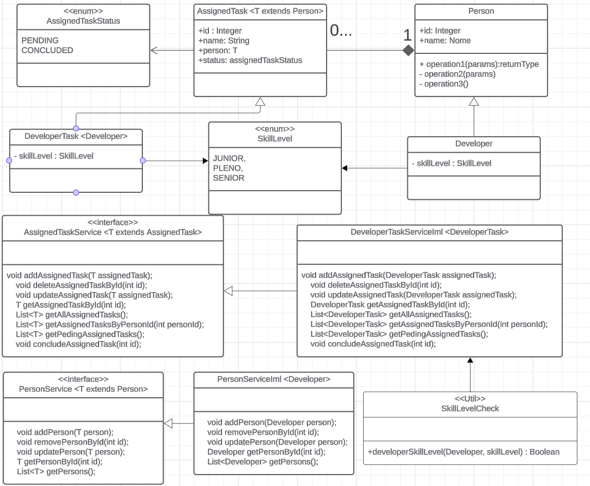
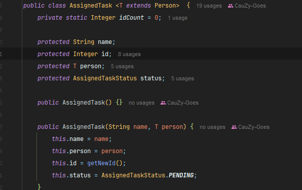
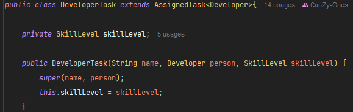
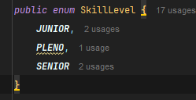
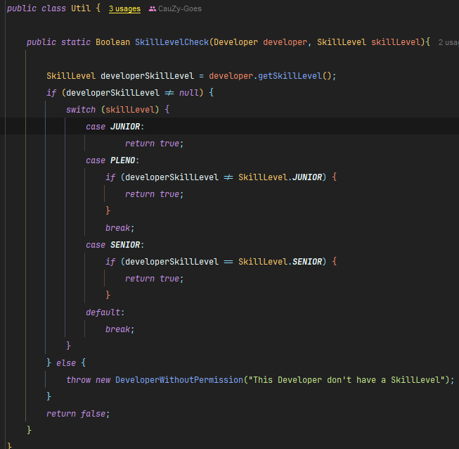
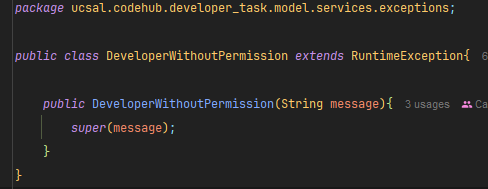
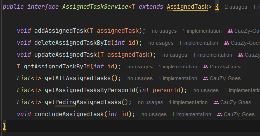
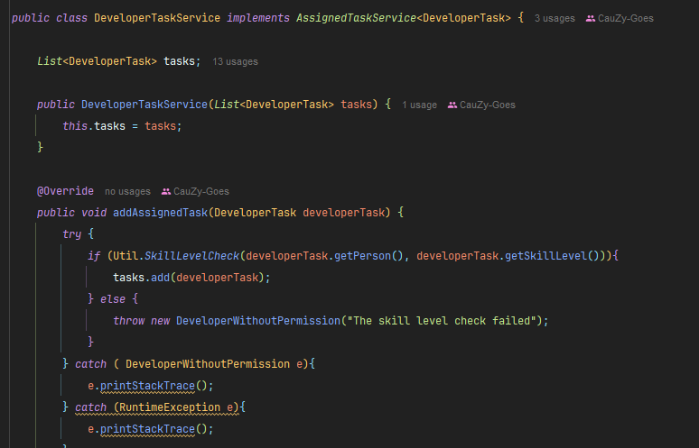

# Developer-Task

This project is a simple Java application for managing tasks and devs. Each task is assigned to a developer but it needs to have the necessary skill level to be assigned to a task. The task can have a status of pending or completed. The project uses entities to represent tasks and developers, and services to manage these entities.

## Features

- **Create:** Add new developers and tasks at localStorage.
- **Read:** Retrieve information about developers and tasks from the local Storage.
- **Update:** Modify existing developers and tasks details.
- **Delete:** Remove developers and tasksfrom the local storage.
- **Skill System:** The developers only can be assigned to a task if them have the same or higher skill level of the task.

## Getting Started

### Pre-requisites

- Java Development Kit (JDK)

### Installation

1. Clone the repository to your local machine:

## Screenshots

### Class Diagram

### DeveloperTask Entity

### SkillLevel System
  
  
  

### DeveloperTask Service

## Technologies Used

- Java

## Contributors

- [CauZy-Dev](https://github.com/cauzy-dev) Cauã Goes
- [Yan-Pi](https://github.com/yan-pi) Yan Fernandes
- [Zadriw](https://github.com/ZadriW) Adriano Abreu
- [CauZy-Dev](https://github.com/cauzy-dev) Guilherme Andrade
- [CauZy-Dev](https://github.com/cauzy-dev) Kailan Souza

## License

This project is licensed under the [Licença MIT](https://github.com/Codee-Hub/Developer-Task/blob/main/LICENSE).

